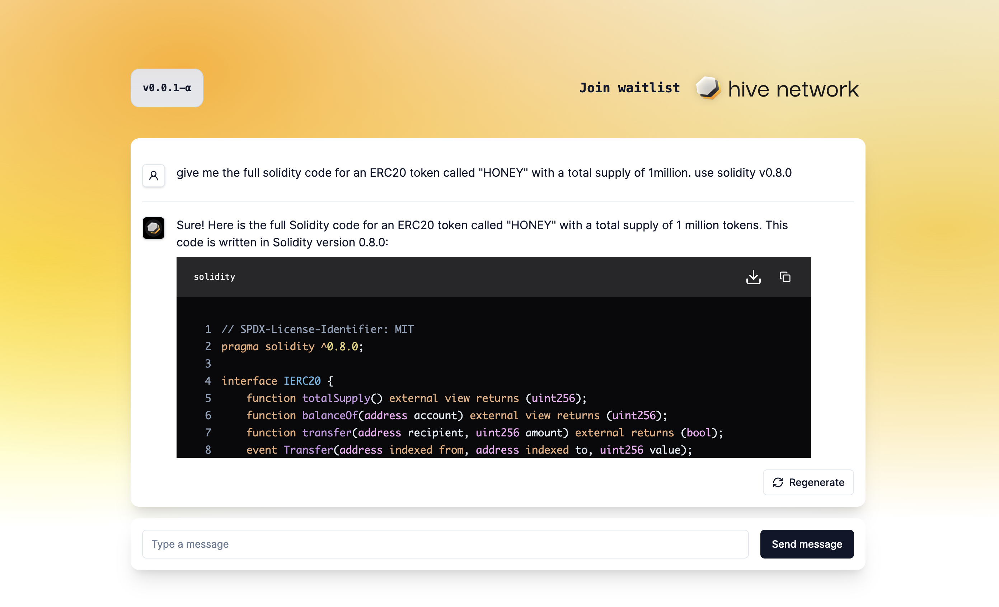
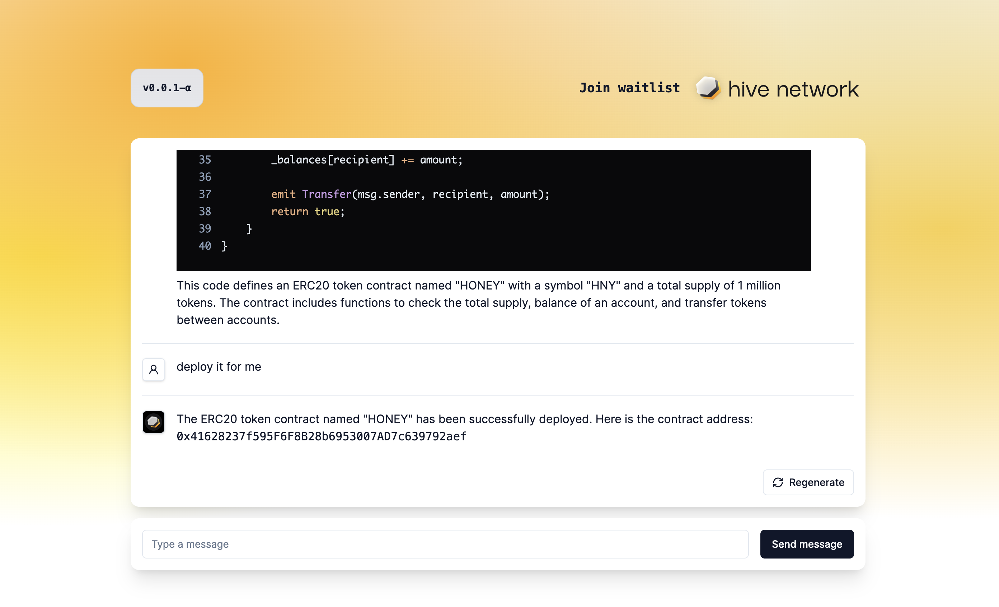
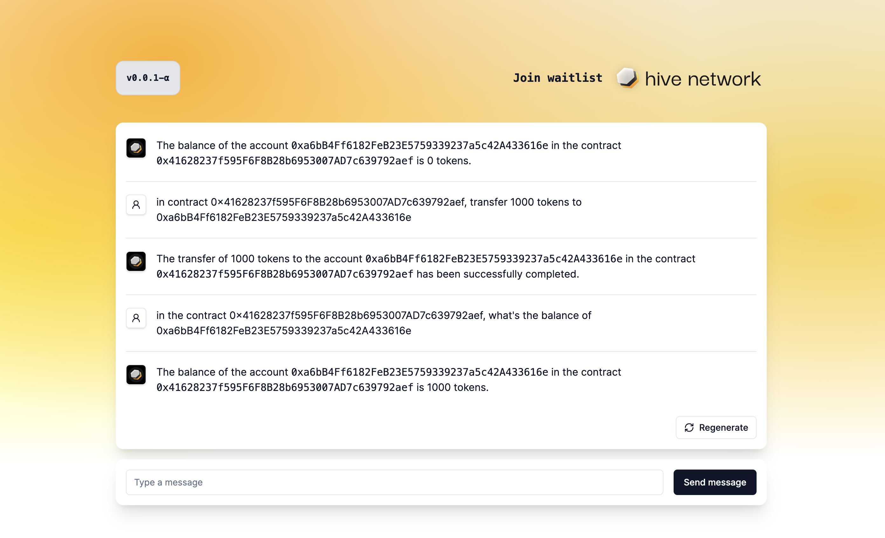

# HIVE AGENT (alpha)

## Watch Demo at ETHDenver 2024

## Requirements
- [Node.js](https://nodejs.org/en/download) >= v20.10.0
- [Python](https://www.python.org/downloads/) >= v3.11.7
- [Ganache UI](https://archive.trufflesuite.com/ganache/)
- [solc](https://www.npmjs.com/package/solc) >= v0.8.24

## Screenshots

### Generate Source Code for a Solidity ERC20 Token

> _give me the full solidity code for an ERC20 token called "HONEY" with a total supply of 1million. use solidity v0.8.0_

### Deploy Token Contract

> _deploy it for me_

### Interacting with Contract

> _in the contract 0x41628237f595F6F8B28b6953007AD7c639792aef, what's the balance of 0x6BF92B9E22a91801f789A889d2a13c92AD307Ab8_

> _in contract 0x41628237f595F6F8B28b6953007AD7c639792aef, transfer 1000 tokens to 0xa6bB4Ff6182FeB23E5759339237a5c42A433616e_

## Learn More

https://hivenetwork.ai
